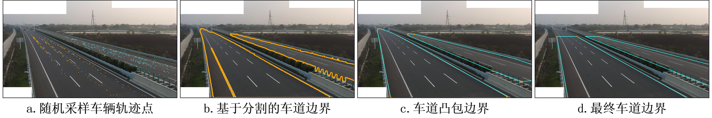
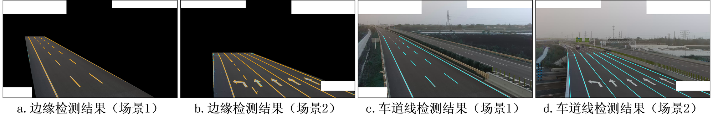
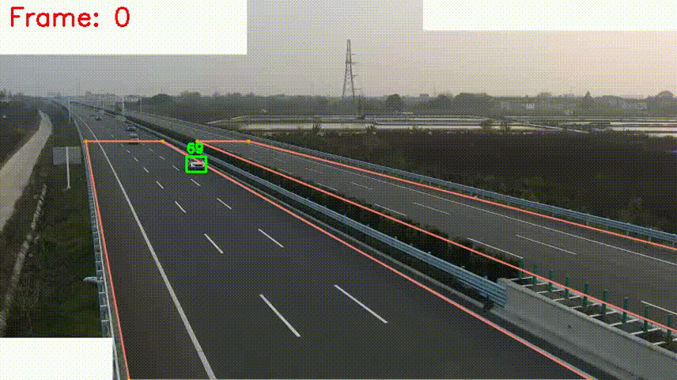

<div align="center">

# HighwayTrack - Online Multi-Vehicle Tracker for Highway Scenarios
[简体中文](./README.md) | [English]

</div>

## Introduction
### ***Part.1***
> [**高速公路相机全自动标定及车道空间模型构建**](./papers/高速公路相机全自动标定及车道空间模型构建_蒋俊杰.pdf)
> 
> Junjie Jiang, Aodong Shen
>
> *[paper](./papers/高速公路相机全自动标定及车道空间模型构建_蒋俊杰.pdf)*
> 
 
 

### ***Part.2***
> [**HighwayTrack-Online Multi-Vehicle Tracker for Highway Scenarios(Stay tuned)**]()
> 
> Junjie Jiang, Aodong Shen
>
>*[paper]()*

<div align="center">
 
 
</div>

***HighwayTrack*** is an online multi-vehicle tracker designed for highway scenarios.

Performance metrics comparison on our custom highway dataset (comparing HighwayTrack with [ByteTrack](https://github.com/ifzhang/ByteTrack)):


| Tracker       | HOTA | MOTA | IDF1 | MOTP | FPS  |
|---------------|------|------|------|------|------|
| HighwayTrack  | 71.96| 83.01| 90.68| 83.82| ≈20.0|
| ByteTrack     | 66.88| 73.99| 84.94| 86.42| ≈25.0|

## Installation Steps

Follow these steps to set up the environment and install the necessary packages:

### 1. Install highwayTrack and create a new virtual environment

```bash
git clone https://github.com/TripleJoy/highwayTrack
cd highwayTrack
conda create --name your_env python=3.9
conda activate your_env
```

### 2. Install PyTorch

```bash
pip install torch==2.0.0+cu117 torchvision==0.15.1+cu117 torchaudio==2.0.1 --index-url https://download.pytorch.org/whl/cu117
```

### 3. Install additional packages

```bash
pip install -r requirements.txt
```

### 4. Modify PyTorch files

To address compatibility issues between the YOLOv5 model and newer versions of PyTorch

Open the file `C:\ProgramData\Anaconda3\envs\your_env\Lib\site-packages\torch\nn\modules\upsampling.py` and change the code on lines 155 to 157 to:

```python
def forward(self, input: Tensor) -> Tensor:
    # return F.interpolate(input, self.size, self.scale_factor, self.mode, self.align_corners,
    #                      recompute_scale_factor=self.recompute_scale_factor)
    return F.interpolate(input, self.size, self.scale_factor, self.mode, self.align_corners)
```
Save the file after making the changes.

Note: The above steps assume that the user has sufficient permissions to modify files in the Anaconda environment folder. If you encounter permission issues, you may need administrative rights to modify the files.

## Pretrained Models and Sample Data Preparation

- Please download the required pretrained models and sample data from [Baidu Cloud](https://pan.baidu.com/s/10NlXc2eLWxSvCf3M_IbPwA?pwd=7s5g) or [Google Drive](https://drive.google.com/drive/folders/1yJxaMqdEIfLqfBFJxv6PV_Hhn1IT1hMf).
- Place the `models` folder in the `highwayTrack` directory.
- If you wish to run the example, place the `demo` folder in the `highwayTrack/source` directory.

***The final directory structure should look like this:***

```
highwayTrack
   |————camera_calibration
   | 
   └————config
   | 
   └————det
   |
   |————models
   |       └————det
   |             └————yolov5l.pt
   |       └————seg
   |             └————sam_vit_h_4b8939.pth
   └————source
   |       └————demo
   |             └——————config.yaml
   |             └——————demo.mp4
   |             └——————demo_gt.txt
   └————tools
   | 
   └————track
   | 
   └————TrackEval
```

## Sample Run

```bash
python run.py -n demo.mp4 -e
```

## Running with Custom Data

### **step1-Data Preparation**

Assuming your custom video file is named `xx.mp4`, please follow these steps to prepare the data:

1. ***Create a video directory:***
   - Create a new folder named `xx` in the `highwayTrack/source` directory.
   - Move the video file `xx.mp4` to this newly created folder.

2. ***Configuration file setup:***
   - In the `highwayTrack/source/xx` directory, create a new file named `config.yaml`.
   - Copy the contents from `config/base_config.yaml` to `config.yaml` and modify as necessary, [see documentation](./config/config-readme-en.md).

3. ***Save ground truth data for performance evaluation on custom video data:***
   - If you want to evaluate performance on custom video data, move the ground truth data file (GT file) to the `highwayTrack/source/xx` directory and rename it to `xx_gt.txt`.
   - The GT file should be formatted as follows: `{frame_id, vehicle_id, box_top, box_left,

 box_right, box_bottom}`.

### **step2-Running**

***Quick Start***

```bash
python run.py -n xx.mp4
```
***If you only want the results of camera calibration.***

```bash
python run.py --name xx.mp4 --camera_cal_only
```
***If you only want the results of highwayTrack tracking.*** (Ensure required preceding files have been generated or replace with local data)

```bash
python run.py --name xx.mp4 --track_only
```
***If you want to evaluate performance on custom video data while getting results.*** (Ensure you have performed step1-3)

```bash
python run.py --name xx.mp4 -e
```

***You can also directly run intermediate steps*** (Ensure required preceding files have been generated or replace with local data)

**For example:**
```bash
python s7_highwayTrack.py --name xx.mp4
```
**Or**
```bash
python s8_eval.py --name xx.mp4
```

## Results

- All results (including those generated during intermediate steps) are saved in the `highwayTrack/middle_file` directory, with header comments corresponding to their data structure.
- The camera calibration visualization process is saved in the `highwayTrack/data_visualization` directory.
- Various evaluation metrics will be displayed on the command line.

## Acknowledgements
A significant portion of the code and models is inspired by [YOLOv5](https://github.com/ultralytics/yolov5), [TPH-YOLOv5](https://github.com/cv516Buaa/tph-yolov5), [segment-anything](https://github.com/facebookresearch/segment-anything), and [ByteTrack](https://github.com/ifzhang/ByteTrack). Many thanks to them for their excellent work.
