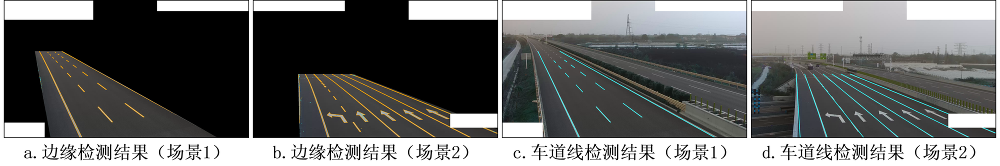
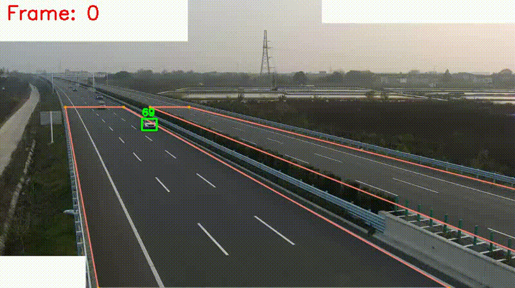

<div align="center">

# HighwayTrack-高速公路场景下的在线多车辆跟踪器
简体中文 | [English](./README-EN.md)

</div>

## 简介
### 第一部分

> [**高速公路相机全自动标定及车道空间模型构建**](./papers/高速公路相机全自动标定及车道空间模型构建_蒋俊杰.pdf)
>
> Junjie Jiang, Aodong Shen
>
>  *[paper](./papers/高速公路相机全自动标定及车道空间模型构建_蒋俊杰.pdf)*

 
 

### 第二部分
> [**HighwayTrack-Online Multi-Vehicle Tracker for Highway Scenarios(敬请期待)**]()
>
> Junjie Jiang, Aodong Shen
>
> *[paper]()*

<div align="center">
 
 
</div>

***HighwayTrack***是一个高速公路场景下的在线多车辆跟踪器，基于相机标定的车辆位置比较跟踪。

在我们自定义高速视频数据集下的各项评价指标（HighwayTrack与[ByteTrack](https://github.com/ifzhang/ByteTrack)比较）：


| Tracker    | HOTA | MOTA | IDF1 | MOTP | FPS |
|------------|------|------|------|------|-----|
|ByteTrack   | 66.88| 73.99| 84.94| 86.42| ≈25.0|
|**HighwayTrack**| **71.96**| **83.01**| **90.68**| **83.82**| **≈20.0**|

## 安装步骤

按照以下步骤来设置环境并安装必要的包：

### 1. 安装highwayTrack并创建一个新的虚拟环境

```bash
git clone https://github.com/TripleJoy/highwayTrack
cd highwayTrack
conda create --name your_env python=3.9
conda activate your_env
```

### 2. 安装 PyTorch

```bash
pip install torch==2.0.0+cu117 torchvision==0.15.1+cu117 torchaudio==2.0.1 --index-url https://download.pytorch.org/whl/cu117
```

### 3. 安装额外的包

```bash
pip install -r requirements.txt
```

### 4. 修改 PyTorch 文件

为了解决 YOLOv5 模型与 PyTorch 高版本之间的兼容性问题

打开文件 `C:\ProgramData\Anaconda3\envs\your_env\Lib\site-packages\torch\nn\modules\upsampling.py`，并将第155至157行的代码改为：

```python
def forward(self, input: Tensor) -> Tensor:
    # return F.interpolate(input, self.size, self.scale_factor, self.mode, self.align_corners,
    #                      recompute_scale_factor=self.recompute_scale_factor)
    return F.interpolate(input, self.size, self.scale_factor, self.mode, self.align_corners)
```
完成修改后保存文件。

注意：以上步骤假设用户具备足够的权限去修改 Anaconda 环境文件夹中的文件。如果遇到权限问题，可能需要管理员权限来修改文件。

## 预训练模型及示例数据准备

- 请从 [百度网盘](https://pan.baidu.com/s/10NlXc2eLWxSvCf3M_IbPwA?pwd=7s5g) 或 [Google Drive](https://drive.google.com/drive/folders/1yJxaMqdEIfLqfBFJxv6PV_Hhn1IT1hMf) 下载所需的预训练模型与示例数据。
- 将 `models` 文件夹放置在 `highwayTrack` 目录下。
- 如果您希望运行示例，请将 `demo` 文件夹放置在 `highwayTrack/source` 目录下。
  
***最终目录结构应如下所示：***

```
highwayTrack
   |————camera_calibration
   | 
   └————config
   | 
   └————det
   |
   |————models
   |       └————det
   |             └————yolov5l.pt
   |       └————seg
   |             └————sam_vit_h_4b8939.pth
   └————source
   |       └————demo
   |             └——————config.yaml
   |             └——————demo.mp4
   |             └——————demo_gt.txt
   └————tools
   | 
   └————track
   | 
   └————TrackEval
```

## 示例运行

```bash
python run.py -n demo.mp4 -e
```

## 自定义数据运行

### **step1-数据准备**

假设您的自定义视频文件命名为 `xx.mp4`，请按照以下步骤准备数据：

1. ***创建视频目录：***
   - 在 `highwayTrack/source` 目录下创建一个名为 `xx` 的新文件夹。
   - 将视频文件 `xx.mp4` 移动到这个新创建的文件夹中。

2. ***配置文件设置：***
   - 在 `highwayTrack/source/xx` 目录中，新建一个名为 `config.yaml` 的文件。
   - 从 `config/base_config.yaml` 拷贝内容到 `config.yaml` 并根据需要进行修改，[详见文档](./config/config-readme.md)。

3. ***保存地面真实数据用于自定义视频数据的性能评估：***
   - 如果您想在自定义视频数据上评估性能，请将地面真实数据文件 (GT 文件) 移动到 `highwayTrack/source/xx` 目录，并重命名为 `xx_gt.txt`。
   - GT 文件应该按以下格式组织：`{frame_id, vehicle_id, box_top, box_left, box_right, box_bottom}`。
     
### **step2-运行**

***快速开始***

```bash
python run.py -n xx.mp4
```
***如果您只想获得相机标定的结果。***

```bash
python run.py --name xx.mp4 --camera_cal_only
```
***如果您只想获得highwayTrack跟踪的结果。***（确保所需的前置文件已经生成或用本地数据替换）

```bash
python run.py --name xx.mp4 --track_only
```
***如果您在得到结果同时想在自定义视频数据上评估性能。***（确保您执行了step1中的步骤3）

```bash
python run.py --name xx.mp4 -e
```

***您也可以直接运行中间步骤***（确保所需的前置文件已经生成或用本地数据替换）

**例如：**
```bash
python s7_highwayTrack.py --name xx.mp4
```
**或者**
```bash
python s8_eval.py --name xx.mp4
```

## 结果

- 所有结果（包括中间步骤生成的）文件均保存在 `highwayTrack/middle_file` 目录下，文件头部注释内容对应其数据结构。
- 相机标定的可视化过程保存在 `highwayTrack/data_visualization` 目录下。
- 各项评估指标将在命令行中显示。

## 致谢
很大一部分代码与模型借鉴自[YOLOv5](https://github.com/ultralytics/yolov5)、[TPH-YOLOv5](https://github.com/cv516Buaa/tph-yolov5)、[segment-anything](https://github.com/facebookresearch/segment-anything)、[ByteTrack](https://github.com/ifzhang/ByteTrack)和[TrackEval](https://github.com/JonathonLuiten/TrackEval)。非常感谢他们的精彩作品。
